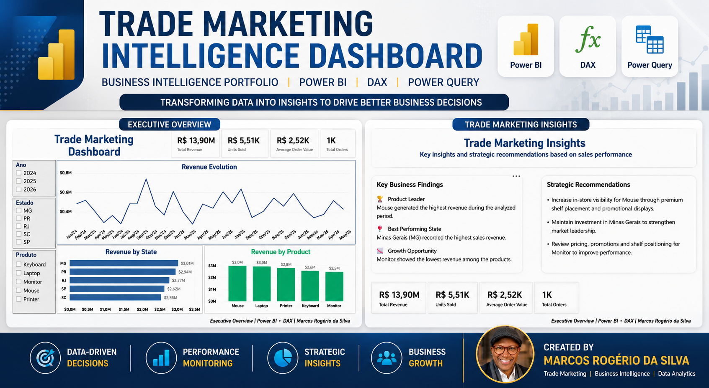
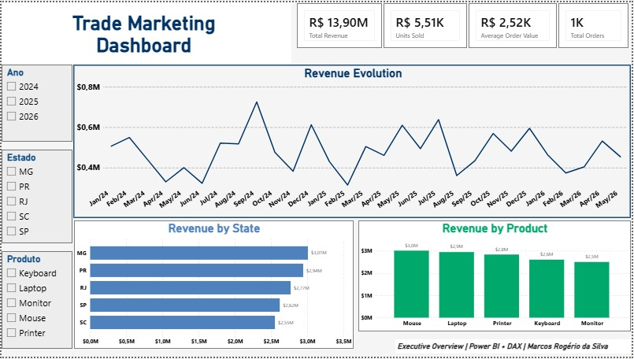
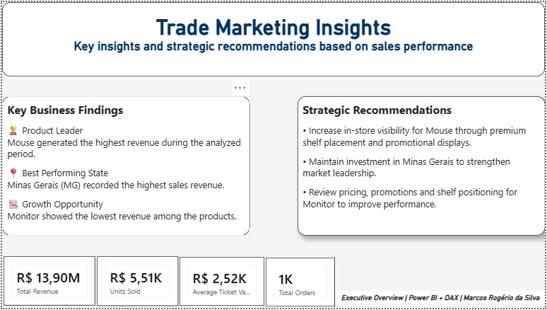

# 📊 Trade Marketing Intelligence Dashboard

  

Transforming sales data into actionable business insights through interactive dashboards and data-driven decision-making.

 

---

## 📌 Project Overview

This project simulates a real-world Business Intelligence solution developed for a Trade Marketing department.

The dashboard consolidates sales and profitability data into an interactive Power BI report, enabling managers to monitor KPIs, analyze commercial performance, compare regions and product categories, and support data-driven decision-making.

The primary goal is to transform raw sales data into actionable business insights through clear, interactive, and user-friendly visualizations.

---

## 🎯 Business Problem

Trade Marketing teams need to monitor sales performance, profitability, product categories, regions, and commercial execution in order to support faster and more accurate business decisions.

However, when this information is analyzed manually through spreadsheets, it becomes harder to identify performance gaps, compare regions, track key indicators, and understand which products or categories are driving business results.

---

## 💡 Business Solution

To address these challenges, an interactive Business Intelligence dashboard was developed using Microsoft Power BI.

The solution centralizes sales and profitability data into a single, easy-to-use report, allowing decision-makers to monitor business performance through dynamic visualizations and key performance indicators (KPIs).

The dashboard enables users to:

* Monitor overall sales performance and profitability.
* Compare sales results across different regions.
* Analyze product categories and individual product performance.
* Track key business metrics through interactive filters.
* Support faster, data-driven decision-making.

By transforming raw sales data into meaningful insights, the dashboard provides a clear overview of commercial performance and helps identify opportunities for business improvement.

---

## ❓ Business Questions

The dashboard was designed to answer the following business questions:

* What is the total sales revenue?
* What is the total profit generated?
* Which regions have the highest sales performance?
* Which product categories generate the highest profit?
* Which products contribute most to revenue?
* What is the current profit margin?
* How many units have been sold?
* How does commercial performance vary across regions and categories?

---

## 📈 Dashboard Pages

### Executive Overview

This page provides an executive summary of the company's commercial performance through high-level KPIs and strategic visualizations.

Main features:

* Total Sales
* Total Profit
* Profit Margin
* Units Sold
* Sales by Region
* Sales by Category
* Sales Trend
* Interactive Filters

### Trade Marketing Insights

This page focuses on product and regional performance, supporting commercial analysis and trade marketing decisions.

Main features:

* Product Performance
* Category Analysis
* Regional Comparison
* Sales Distribution
* Profit Analysis
* Interactive Drill-down

---

## 📊 Key Performance Indicators (KPIs)

The dashboard includes the following business metrics:

* Total Sales
* Total Profit
* Profit Margin
* Units Sold
* Number of Orders
* Sales by Region
* Sales by Category
* Product Performance

---

## 🛠 Technologies Used

* Microsoft Power BI
* Power Query
* DAX
* Microsoft Excel

---

## 📂 Data Source

The dataset used in this project is fictional and was created exclusively for portfolio purposes.

It simulates sales transactions from a Trade Marketing operation, including products, categories, regions, sales values, costs, quantities, and profitability information.

---

## 📁 Repository Structure

Trade Marketing Intelligence Dashboard

├── Dashboard

├── Data

├── Images

└── README.md

---

# 🖼 Dashboard Preview

## Executive Overview

---

## Trade Marketing Insights

---

# 💡 Key Insights

The dashboard enables stakeholders to quickly identify important business patterns, including:

* Sales performance across different regions.
* Best-performing product categories.
* Products generating the highest revenue.
* Profitability trends over time.
* Regional opportunities for commercial growth.
* Overall business performance through executive KPIs.

These insights support faster and more informed business decisions.

---

# 📚 What I Learned

During this project, I strengthened both technical and analytical skills, including:

* Data modeling in Power BI.
* Data transformation using Power Query.
* KPI development with DAX.
* Dashboard design focused on user experience.
* Business-oriented data storytelling.
* Business Intelligence best practices.
* Git and GitHub for version control and portfolio management.
* Technical documentation through a professional README.

---

## 🚀 Future Improvements

This project represents the first step in my Business Intelligence portfolio.

As I continue expanding my skills in Data Analytics, future versions of this project will include:

* SQL integration for automated data extraction.
* Python-based data preprocessing.
* Advanced DAX calculations and Time Intelligence (MTD, YTD, and YoY).
* Forecasting and trend analysis.
* Additional drill-through pages.
* Mobile-optimized dashboard layout.
* Deployment using Power BI Service.

---

# 👨‍💻 Author

**Marcos Rogério da Silva**

Trade Marketing | Business Intelligence | Data Analytics

* GitHub: https://github.com/marcosrdevbr
* LinkedIn:https://www.linkedin.com/in/marcos-rogerio-017923302/

Feel free to connect or share feedback about this project.
